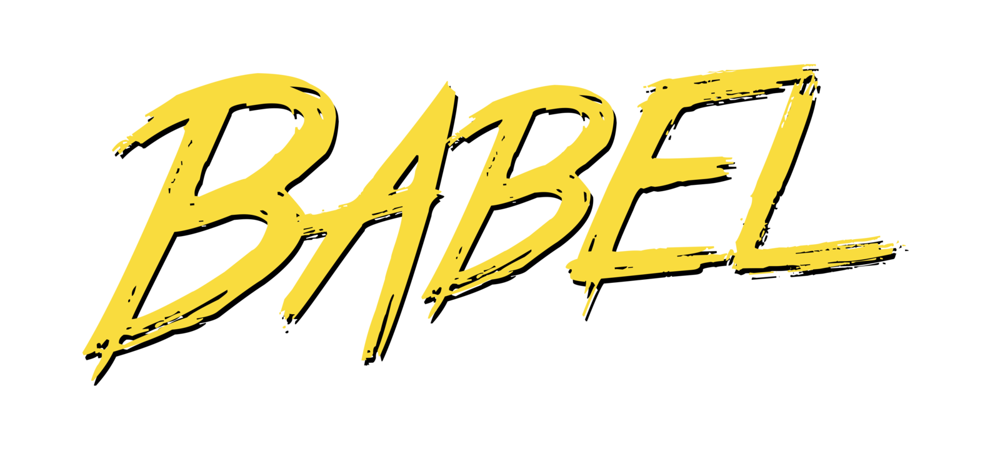
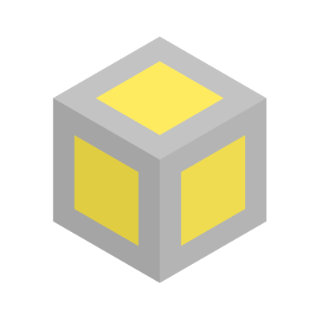
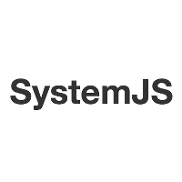

### aurelia-skeleton-navigation

* [6 starter kits](https://github.com/aurelia/skeleton-navigation)
*  <!-- .element: class="plain vmiddle" height="75" -->
 <!-- .element: class="plain vmiddle" height="75" -->
or
 <!-- .element: class="plain vmiddle" height="75" -->
*  <!-- .element: class="plain vmiddle" height="75" -->
 <!-- .element: class="plain vmiddle" height="75" -->
or
 <!-- .element: class="plain vmiddle" height="75" -->
 <!-- .element: class="plain vmiddle" height="75" -->
*  <!-- .element: class="plain vmiddle" height="75" -->
 <!-- .element: class="plain vmiddle" height="75" -->
*  <!-- .element: class="plain vmiddle" height="75" -->
 <!-- .element: class="plain vmiddle" height="75" -->
