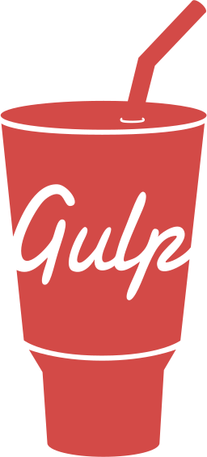

### Using

 <!-- .element: class="plain vmiddle" height="100" -->
 <!-- .element: class="plain vmiddle" height="100" -->
 <!-- .element: class="plain vmiddle" height="100" -->
 <!-- .element: class="plain vmiddle" height="100" -->
 <!-- .element: class="plain vmiddle" height="100" -->
 <!-- .element: class="plain vmiddle" height="100" -->
 <!-- .element: class="plain vmiddle" height="100" -->

### Learning

 <!-- .element: class="plain vmiddle" height="100" -->
 <!-- .element: class="plain vmiddle" height="100" -->
 <!-- .element: class="plain vmiddle" height="100" -->
 <!-- .element: class="plain vmiddle" height="100" -->

### Regurgitating

[mttmccb.github.io](http://mttmccb.github.io) [@mttmccb](https://twitter.com/mttmccb)